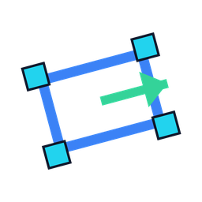
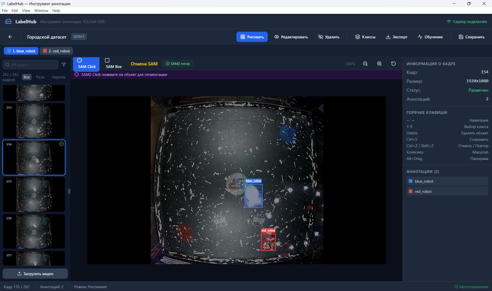
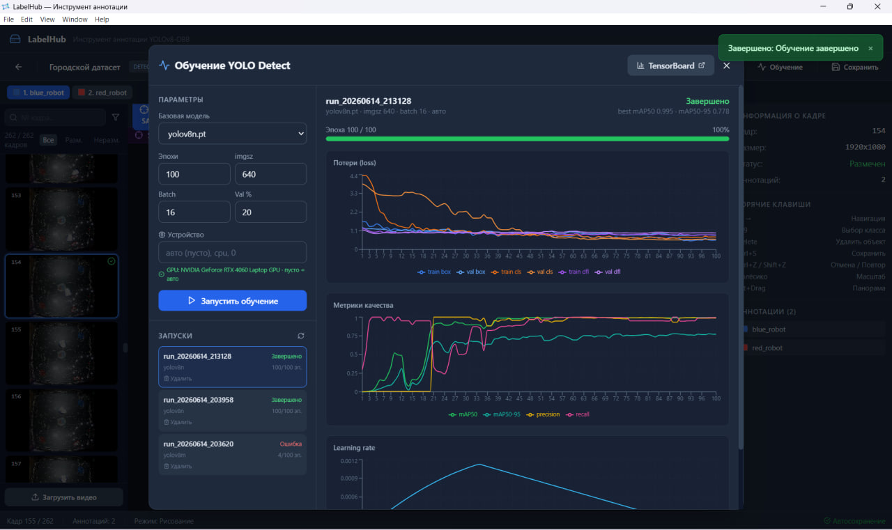
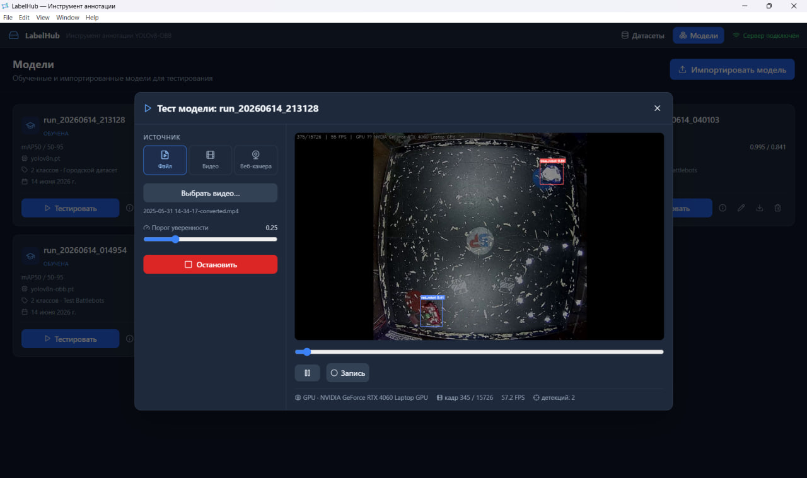
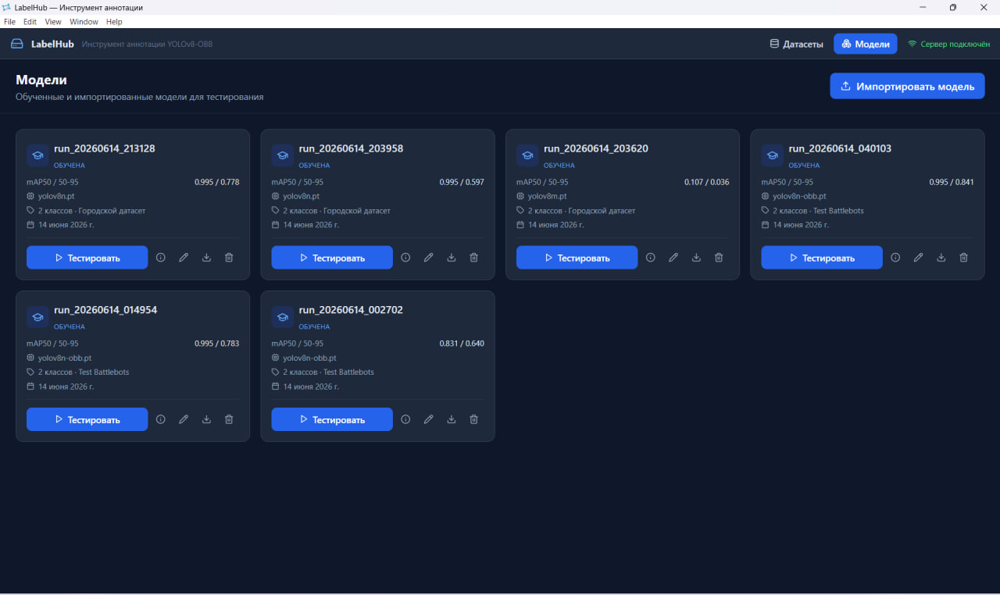

<div align="center">



# LabelHub

### Annotate · Train · Test — a local-first desktop studio for YOLO datasets and models

Draw boxes, oriented boxes or polygons (with one-click **SAM2** magic), then train and test
**Ultralytics YOLO** models — all in one app, all on your machine. No cloud, no accounts, no uploads.


</div>

<p align="center">
  
</p>

---

## ✨ Why LabelHub

Most annotation tools stop at labeling. LabelHub takes you from **raw video to a trained, tested model**
without ever leaving the window:

- 🎯 **Three task types, one tool** — **Detect** (axis-aligned boxes), **OBB** (oriented boxes with a
  heading arrow) and **Segmentation** (instance polygons). You pick the type when you create a project,
  and every tool, export and training run adapts to it.
- 🪄 **SAM2 magic click** — point or drag, and Segment Anything 2 turns it into a precise mask → polygon
  or box. Loads in the background so the app starts instantly.
- 🎞️ **Video → frames** — drop in an `.mp4`/`.avi`/`.mov`, pick an FPS, and LabelHub extracts frames ready
  to label.
- 🧠 **Train in-app** — launch **YOLOv8** or **YOLO11** (n/s/m/l/x) training with live loss/mAP charts,
  GPU auto-detection, and a one-click TensorBoard.
- 🧪 **Live model tester** — run any trained or imported model over a video file or webcam and watch the
  detections in real time, with an FPS counter and recording.
- 🔁 **Import & export** — round-trip standard **YOLO** datasets (detect / OBB / seg), including class
  names from `data.yaml`, plus COCO and Pascal-VOC export.
- 💾 **Auto-save & fast startup** — your work is saved automatically; heavy libraries (PyTorch, SAM2) warm
  up in the background so the window opens in ~1.5 s, not 30.
- 🔒 **Local-first** — a single-user desktop app bound to `127.0.0.1`. Your images never leave your disk.

---

## 📸 Screenshots

<table>
  <tr>
    <td width="50%"></td>
    <td width="50%"></td>
  </tr>
  <tr>
    <td align="center"><b>Annotate</b> — draw / SAM2, multi-class, auto-save</td>
    <td align="center"><b>Train</b> — live loss &amp; mAP charts, GPU, TensorBoard</td>
  </tr>
  <tr>
    <td width="50%"></td>
    <td width="50%"></td>
  </tr>
  <tr>
    <td align="center"><b>Test</b> — real-time inference on video / webcam</td>
    <td align="center"><b>Models</b> — registry of trained &amp; imported models</td>
  </tr>
</table>

---

## 🚀 Quick start

> **Prerequisites:** [Python 3.10+](https://www.python.org/downloads/) and
> [Node.js 18+](https://nodejs.org/) on your `PATH`. A CUDA GPU is optional but makes training and the
> live tester much faster.

### Windows

```bat
git clone https://github.com/GeBondar/LabelHub.git
cd LabelHub
install.cmd        ::  one-time setup: venv + dependencies + web build
run.cmd            ::  launch the app
```

### Linux / macOS

```bash
git clone https://github.com/GeBondar/LabelHub.git
cd LabelHub
chmod +x install.sh run.sh
./install.sh       #  one-time setup
./run.sh           #  launch the app
```

The first install downloads PyTorch and Ultralytics, so it can take a few minutes. After that the app
opens in a second or two — the heavy AI libraries finish loading in the background while you work.

---

## 🧭 Usage walkthrough

1. **Create a project** and choose its **task type** — *Detect*, *OBB* or *Segmentation*. This is fixed
   for the project and drives everything downstream.
2. **Add images** — upload a video and extract frames at the FPS you want (or import an existing dataset).
3. **Define classes** — name them and give them colours. The first class is auto-selected, so every new
   object you draw is labeled immediately.
4. **Annotate:**
   - **Draw** — drag a box (Detect/OBB) or click polygon vertices (Segmentation).
   - **SAM2** — click an object or drag a rough box; SAM2 produces the mask/box for you.
   - Set the **heading arrow** for OBB, switch classes with number keys, undo/redo, pan & zoom.
   - Everything **auto-saves** — the frame is marked *labeled* the moment it has an annotation.
5. **Export** the dataset (YOLO matching your task type, or COCO / Pascal-VOC) with train/val/test split
   and optional augmentation.
6. **Train** a YOLOv8 or YOLO11 model in-app — pick the base size, epochs, image size, batch and device.
   Watch loss and mAP update live; open TensorBoard for the deep dive.
7. **Test** the model on a video or webcam in the live tester, tweak the confidence threshold, and record
   the result.

---

## 🧩 Task types & dataset formats

| Task | What you draw | YOLO label line |
|------|---------------|-----------------|
| **Detect** | Axis-aligned box | `cls cx cy w h` |
| **OBB** | Oriented box + heading | `cls x1 y1 x2 y2 x3 y3 x4 y4` |
| **Segmentation** | Instance polygon | `cls x1 y1 … xn yn` |

Importing a YOLO dataset reads class **names** straight from its `data.yaml` (dict, list or inline form),
so your classes arrive named — not as `class_0`, `class_1`.

---

## 🧱 Architecture

```
┌──────────────────────────┐       HTTP / WebSocket        ┌───────────────────────────────┐
│   Electron + React UI    │  ──────────────────────────►  │  FastAPI backend (127.0.0.1)  │
│   annotation canvas,     │  ◄──────────────────────────  │  SQLite · local file storage  │
│   panels, live charts    │                               │  Ultralytics · SAM2 · OpenCV  │
└──────────────────────────┘                               └───────────────────────────────┘
```

- **Frontend** — Electron shell + React + Fabric.js canvas + Recharts (`electron/`).
- **Backend** — FastAPI + SQLAlchemy (async SQLite), Ultralytics YOLO, SAM2, OpenCV, Albumentations
  (`backend/`). It is launched automatically by the app and bound to localhost only.
- Heavy imports (PyTorch, Albumentations, SAM2) are **lazy / background-loaded** so startup is fast.

---

## 🪄 Optional: SAM2 (click-to-segment)

SAM2 powers the magic-click annotation. The app works fully without it — the toolbar badge simply shows
*SAM2 unavailable*. To enable it:

```bash
# 1. Install SAM2 into the same environment
git clone https://github.com/facebookresearch/sam2.git
cd sam2 && pip install -e . && cd ..

# 2. Download the checkpoint and place it at  models/sam2_hiera_large.pt
#    https://dl.fbaipublicfiles.com/segment_anything_2/072824/sam2_hiera_large.pt
```

Restart LabelHub; the badge in the annotation toolbar turns green once SAM2 has warmed up.

## ⚡ Optional: GPU acceleration

`install.cmd` installs the default PyTorch wheel (CPU). For NVIDIA GPUs, install a CUDA build of PyTorch
inside the venv (see [pytorch.org](https://pytorch.org/get-started/locally/)). LabelHub auto-detects the
GPU and shows it in the training panel; training and the live tester then run on CUDA automatically.

---

## 🛠️ Development

```bash
# Backend tests (fast, ~1s, no torch required)
pip install -r backend/requirements-dev.txt
python -m pytest

# Frontend dev server with hot reload (+ auto-started backend)
cd electron && npm start
```

The data directory (SQLite DB, frames, exports, training runs) lives in `data/` and is git-ignored.
Set `LABELHUB_DATA_DIR` to use a different workspace.

---

## ❓ FAQ

- **Does it upload my images anywhere?** No. Everything runs locally; the backend binds to `127.0.0.1`.
- **Do I need a GPU?** No — CPU works for annotation and small trainings. A GPU makes training and the
  live tester dramatically faster.
- **Is SAM2 required?** No, it's optional. Drawing and polygon tools work without it.
- **Which models can I train?** YOLOv8 and YOLO11, sizes n/s/m/l/x, for detect / OBB / segmentation.

---

## 🤝 Contributing

Issues and pull requests are welcome! Please run `python -m pytest` and `npm run build:web` before
submitting. For larger changes, open an issue first to discuss the direction.

## 📄 License

[MIT](LICENSE) © George Bondar

<div align="center">
<sub>Built with FastAPI, Electron, React, Ultralytics YOLO and SAM2.</sub>
</div>
